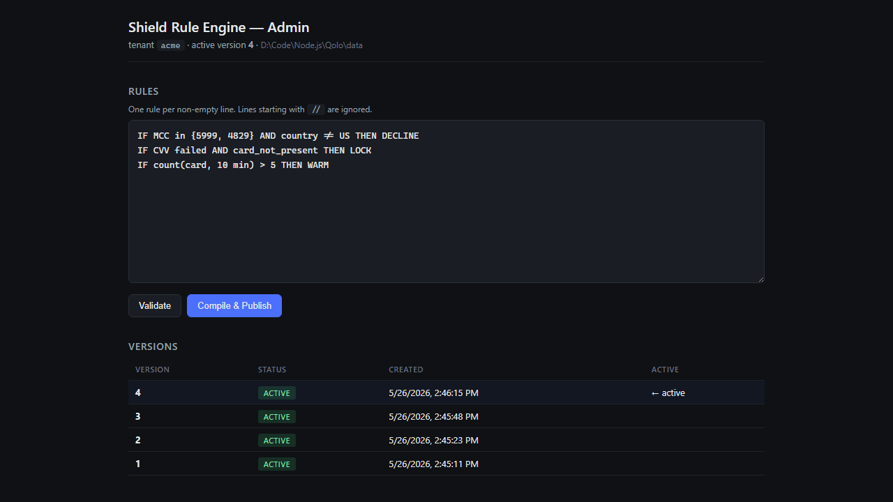

# Shield Rule Engine

Real-time multi-tenant fraud-rule engine. Risk users author rules in a
human-readable DSL through the admin UI; rules are compiled to a safe IR and
evaluated server-side on every authorization within a 300 ms SLA.

See [`docs/REQUIREMENTS.md`](./docs/REQUIREMENTS.md),
[`docs/SPEC.md`](./docs/SPEC.md), and [`docs/PLAN.md`](./docs/PLAN.md).

## Screenshot

The SvelteKit admin UI — author rules in the DSL, validate, compile &
publish, and see the active version alongside the version history.



## Workspace

- `packages/domain` — pure DSL: tokenize, parse, validate, compile, evaluate.
- `packages/use-cases` — Integrations only; orchestrate ports + domain.
- `packages/ports` — interface definitions for infrastructure boundaries.
- `packages/adapters-fs` — filesystem-backed `RuleRepo`, `Audit`, `RulesetEvents` (v1).
- `packages/adapters-memory` — in-process `RulesetCache`, `VelocityStore` (v1).
- `packages/adapters-pg`, `packages/adapters-redis` — reserved slots for future swaps.
- `packages/shared` — small cross-package primitives (logger, ids, time, result).
- `apps/shield-admin` — SvelteKit UI + management API.
- `apps/shield-eval` — Fastify evaluation service (300 ms SLA).

## Develop

```bash
pnpm install
pnpm build
pnpm test
pnpm lint
pnpm format
```

## Architecture

The codebase follows the **Integration / Operation Segregation Principle**
(IOSP). Every function is either:

- an **Operation** — contains logic but does not call other business
  functions; leaf node; preferably pure.
- an **Integration** — composes Operations in a flat sequence; no `if`,
  no `switch`, no loops.

Domain code (`packages/domain`) never imports infrastructure. Use cases
(`packages/use-cases`) depend on **ports**, not concrete adapters. Adapter
selection happens in each app's composition root and nowhere else.

## How it was built — agent-driven SDLC

This project was built end-to-end with an AI coding agent in five sequential
phases. Each phase produced a durable artifact that became the input to the
next, so the work proceeded from *intent → contract → roadmap → code →
verification*.

1. **Requirements** — [`docs/REQUIREMENTS.md`](./docs/REQUIREMENTS.md) was
   written first by hand: goals, the 300 ms SLA, multi-tenancy, the rule DSL
   examples, and the open questions to confirm with the client.
2. **Spec (via conversation with the agent)** —
   [`docs/SPEC.md`](./docs/SPEC.md) was generated through a back-and-forth
   dialogue with the agent that resolved the open questions, pinned down the
   DSL grammar, the compiled IR, the evaluation contract, and the public
   APIs. The conversation is what turned ambiguous requirements into an
   unambiguous contract.
3. **Plan (via conversation with the agent)** —
   [`docs/PLAN.md`](./docs/PLAN.md) was then generated from the spec in a
   second round of dialogue: workspace layout, package boundaries (domain /
   use-cases / ports / adapters), task breakdown, and the order things
   would be built so the architecture would hold up.
4. **Implementation** — only after the plan was agreed did the agent start
   writing code, package by package, following IOSP: pure domain (tokenize
   → parse → validate → compile → evaluate), use-cases as flat integrations
   over ports, and concrete adapters (filesystem, in-memory) selected in
   each app's composition root.
5. **Tests** — finally, the agent added `vitest` suites against the public
   surface of each package: DSL pipeline, decision selection, velocity
   extraction, adapter behavior, and the Fastify evaluator's HTTP contract.

`REQUIREMENTS.md`, `SPEC.md`, and `PLAN.md` are kept in the repo on purpose
— they're not throwaway prompts, they're the durable record of *why* the
code looks the way it does, and the starting context for the next round of
changes.
